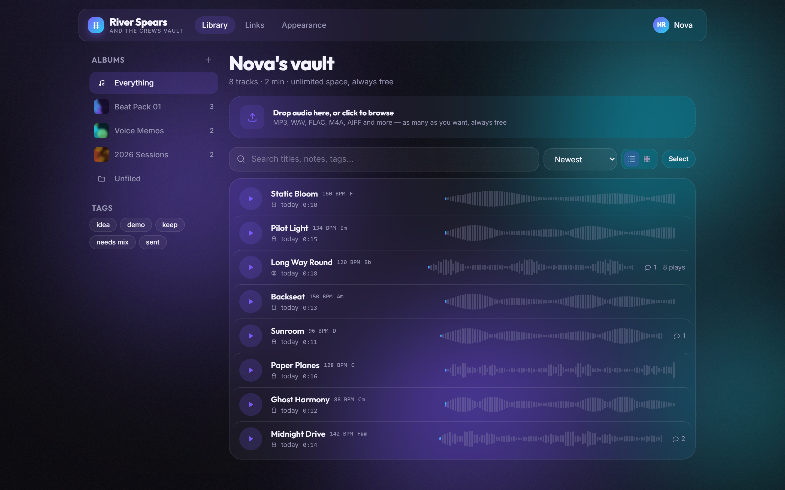

# River Spears and the Crews Vault

A free, unlimited home for unreleased music. Upload as much as you want, sort it
into as many albums as you want, and share private links that bring back feedback
pinned to the exact second.

Built because organising unfinished music shouldn't cost anything.



## What it does

- **Unlimited uploads and albums.** No track cap, no album cap, no storage tier.
  MP3, WAV, FLAC, M4A, AAC, OGG, Opus, AIFF and ALAC.
- **Album covers.** Drop in any image; it is cropped square, resized to 1000px,
  stripped of EXIF and re-encoded. Tracks inherit their album's cover, so it
  shows in the player, on the lyrics screen (blurred into the backdrop) and on
  every share link.
- **Real waveforms.** Every upload is decoded on arrival and reduced to 800 peaks,
  so you can see the track and scrub straight to the drop.
- **Feedback pinned to the second.** Collaborators drop notes at an exact
  timestamp; the markers sit under the waveform and seek when clicked.
- **Private links.** Share one track or a whole album. Toggle downloads, toggle
  comments, set an expiry, revoke instantly. Listeners need no account.
- **Organisation first.** Albums, free-form tags, full-text search across titles,
  notes and tags, six sort orders, multi-select with bulk move and bulk delete.
- **14 animated backgrounds** with your own colours, intensity and speed — two of
  them react to whatever is playing. Your look travels with every link you share.
- **Private by default.** Everything lands private. Nothing is public, listed or
  shared until you say so.
- **Lyrics that sync themselves.** Paste the words and press one button: the
  server transcribes the track with word-level timestamps, matches what it
  hears against your lines, and writes the timings for you. Lines it could not
  hear are interpolated between the ones it could, and it tells you how much
  actually matched. Tapping them in by hand is still there for fixing up.
  They then scroll in time on a full-screen player; click any line to jump.
- **Fifteen visualizers** — bars, mirror, wave, twin wave, orb, ring, bloom,
  ripples, tunnel, starburst, matrix, spiral, terrain, kaleidoscope, sparks —
  drawn from the live audio, full-bleed behind the lyrics and running inside
  the player bar. Size slider, and an honest off switch.
- **Installs on a phone.** It is a PWA; "Add to Home Screen" gives you an app.

## Running it locally

```powershell
.\run.ps1 -Setup   # one time: creates .venv, installs Python + npm deps
.\run.ps1 -Dev     # API on :8000, hot-reloading frontend on :5173
```

Then open http://localhost:5173.

`.\run.ps1` on its own builds the frontend and serves the whole app from
http://localhost:8000 on a single port — the same thing the Docker image does.

Automatic lyric syncing is an optional extra:

```powershell
.\.venv\Scripts\python.exe -m pip install -r backend
equirements-autosync.txt
```

Without it everything else works and the sync button explains itself.

Requires Python 3.11+, Node 20+, and **ffmpeg on PATH** (waveforms and track
length come from it; without it uploads still work but draw flat).

### Optional: demo data

```powershell
.\.venv\Scripts\python.exe backend\scripts\seed_demo.py
```

Creates `demo@vault.fm` / `vaultdemo123` with three albums, eight generated
tracks, comments and a share link. It generates its own audio with ffmpeg.

### Checking it still works

```powershell
.\.venv\Scripts\python.exe backend\scripts\selftest.py
```

106 offline checks covering auth, uploads, waveform analysis, range streaming,
access control, share tokens, expiry, theming, visualizer settings, lyrics,
lyric alignment, cover art and search. No server needed, and no model either —
the alignment maths is tested against synthetic transcripts.

```powershell
node frontend\scripts\shots.mjs      # screenshots of a running instance
```

## Putting it on the internet

### The fast way: a tunnel (no account, no card)

```powershell
.\tunnel.ps1
```

Builds the site, opens a Cloudflare quick tunnel, rewrites `VAULT_PUBLIC_URL` to
match, and starts the server. It prints a public `https://….trycloudflare.com`
address that anyone in the world can open and sign up on.

Two things to know:

- **It is up only while that window is open** and this machine is awake.
- **The address changes every run.** Links you handed out from a previous run
  stop resolving. Fine for showing people today; not how you launch something.

### The permanent way: a real host

Everything below is ready to go; the account-making steps are yours because they
need your own logins.

### 1. Push it to GitHub

```bash
git add -A
git commit -m "Vault"
git remote add origin https://github.com/<you>/vault.git
git push -u origin main
```

### 2. Deploy

**Render** (`render.yaml` is already here): New → Blueprint → pick the repo.
It reads the file, builds the Dockerfile, generates `VAULT_SECRET_KEY` and
attaches a 10 GB disk at `/data`.

**Fly.io** (`fly.toml` is already here):

```bash
fly launch --no-deploy
fly volumes create vault_data --size 10
fly secrets set VAULT_SECRET_KEY=$(python -c "import secrets;print(secrets.token_urlsafe(48))")
fly secrets set VAULT_PUBLIC_URL=https://<your-app>.fly.dev
fly deploy
```

Anywhere else that runs a Docker image works too — it is one container.

> **The disk matters.** The database and the audio both live in `VAULT_DATA_DIR`.
> On a host with no persistent volume, every redeploy wipes the music. Render's
> free tier has no disk, which is why `render.yaml` asks for `starter`.

### 3. Environment variables

| Variable | What it does |
| --- | --- |
| `VAULT_SECRET_KEY` | Signs login tokens. **Set this in production.** Without it, a dev key is generated into `data/.devkey`. Changing it signs everyone out. |
| `VAULT_PUBLIC_URL` | Your real URL. Share links are built from it, and it switches session cookies to `Secure` when it starts with `https://`. |
| `VAULT_DATA_DIR` | Where the database and uploads live. Point it at your mounted volume. |
| `VAULT_GOOGLE_CLIENT_ID` | Turns on "Continue with Google". Email sign-in works without it. |
| `VAULT_MAX_UPLOAD_MB` | Per-file ceiling, default 200. A safety valve against a single enormous file — not a quota. |

### 4. Turning on Google sign-in

1. https://console.cloud.google.com/apis/credentials → **Create credentials** →
   **OAuth client ID** → **Web application**.
2. Under **Authorized JavaScript origins** add your real URL
   (`https://vault.yourdomain.com`) and, for local work,
   `http://localhost:5173`.
3. Copy the client ID into `VAULT_GOOGLE_CLIENT_ID` and redeploy.

There is no client *secret* to handle: the browser gets an ID token from Google
and the server verifies its signature against Google's public keys. Nothing
secret is stored, and the Google button only renders once the server confirms a
client ID is configured.

### Before you hand the link out

- **Storage is the real cost.** Unlimited uploads plus open signup means anyone
  can fill your disk. Watch the volume, and consider moving audio to S3/R2 if it
  takes off.
- **There is no email verification or password reset yet.** Signup is open to any
  address and nobody can recover a forgotten password. Worth adding before you
  push it widely.
- **No rate limiting.** A reverse proxy in front (Cloudflare) covers most of it.

## How it is built

```
backend/app/
  main.py        FastAPI app; also serves the built SPA in production
  models.py      users, folders, tracks, comments, likes, share links
  security.py    bcrypt hashing, JWT sessions (cookie for web, Bearer for mobile)
  audio.py       ffmpeg/ffprobe: duration + 800 normalised waveform peaks
  images.py      cover art: square crop, resize, EXIF strip, thumbnail
  align.py       automatic lyric syncing: transcribe, then match to the words
  jobs.py        one-thread job runner for work too slow for a request
  access.py      who may hear what — ownership, visibility, share tokens
  routers/       auth · users · folders · tracks · comments · share

frontend/src/
  lib/store.tsx        auth + appearance + the single shared audio element
  components/
    Background.tsx     the 14 animated backgrounds (CSS + one canvas loop)
    Waveform.tsx       seek, hover-preview, comment markers
    Player.tsx         persistent bar, expands full screen
    NowPlaying.tsx     full-screen lyrics view, synced to playback
    Visualizer.tsx     fifteen audio-reactive styles on one canvas loop
    LyricsSync.tsx     tap-per-line timestamping
  lib/lyrics.ts        LRC-style parsing: [mm:ss.xx] per line
  pages/               landing · auth · library · track · share · profile · appearance
```

**Stack:** FastAPI + SQLAlchemy + SQLite on the back, React 18 + Vite +
TypeScript + Tailwind + Framer Motion on the front. One container serves both.

### Notes for future work

- Audio is served with HTTP Range support, so seeking does not re-download the
  file. Anything that replaces `_range_response` must keep that.
- Peaks are computed once at upload and stored as JSON on the track. The player
  resamples them to however many bars fit the current width.
- Routes are deliberately **not** wrapped in `<AnimatePresence mode="wait">` —
  the exit handshake never completes and the old page stays mounted. Pages
  animate themselves in instead.
- Auto-sync aligns a *transcript* to the *typed lyrics* rather than trusting
  either alone — singing defeats speech recognition, but whole lines rarely
  vanish, so enough anchor words match to place the rest.
- Whisper on CUDA can construct fine and die on the first decode when cuBLAS
  is missing, so `align.transcribe_words` retries on CPU rather than only
  guarding the model load.
- Covers are never stored as uploaded: `images.save_cover` re-encodes every
  one, which is what strips EXIF (including location) and caps the size.
- Cover URLs carry a `v=` tag from the stored filename, so they can be cached
  `immutable`; a re-upload changes the name and busts it. Small surfaces pass
  `thumb` for the 320px copy.
- Radial visualizers mirror the spectrum around the circle (`radialBin`);
  mapping it linearly makes the loud low bins pile onto one side and the
  whole shape comes out lopsided.
- Beat-triggered styles (sparks, ripples) need an idle pulse, or their
  settings tile is a blank black square when nothing is playing.
- The API serialises UTC without an offset; the client re-attaches it in
  `parseUtc`. Dropping that makes every timestamp drift by your timezone.
- New model columns need an entry in `backend/app/migrate.py`; `create_all`
  only makes missing tables, never missing columns, so a live database keeps
  its old schema otherwise.
- SQLite is fine for a long while here. The migration to Postgres is a
  `DATABASE_URL` swap in `db.py` plus real migrations — the models are portable.

## Ideas not built yet

- Email verification + password reset
- Drag-and-drop reordering inside an album
- Version stacking (v1 → v2 → v3 of the same song, side by side)
- Waveform-region comments rather than single points
- Native phone app — the API already speaks Bearer tokens for exactly this
